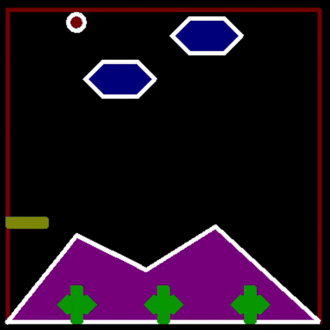

<!-- TITLE with Animated Typing Effect -->

  

  

 

<h1 align="center">🔁 Infinite Ball Bounce Simulation – C++ Turbo Graphics 🔁</h1>
<h3 align="center">A never-ending, auto-animated bouncing ball with dynamic obstacle collision and line clipping logic.</h3>

 

  

 

---

 

## 🚀 Project Overview

> ⚠️ **Note:** This project must be run on **Turbo C++ using Borland Graphics Interface (BGI)**. Use Turbo C++ or an emulator like **DOSBox** for accurate execution.

This C++ graphics project features a **ball endlessly bouncing** within a rectangular window. A horizontally moving **bar (obstacle)** traverses the screen, and whenever the ball collides with it, it gets **deflected**.

What makes this simulation unique is that the **bar is clipped** using the **Cohen-Sutherland Line Clipping Algorithm** — a graphics classic — ensuring it’s only visible when inside the boundary box.

It’s a clean, continuous visual simulation — ideal for understanding clipping, bouncing logic, and retro animation techniques.

 
 

  
  
  

 

---

 

## 🛠️ Tech Stack and Tools

 

<table>
  <thead>
    <tr>
      <th>Technology</th>
      <th>Purpose</th>
    </tr>
  </thead>
  <tbody>
    <tr>
      <td>C++</td>
      <td>Game and animation logic</td>
    </tr>
    <tr>
      <td>BGI (Borland Graphics Interface)</td>
      <td>Rendering graphics inside Turbo C++</td>
    </tr>
    <tr>
      <td>Turbo C++ / DOSBox</td>
      <td>Environment required to run graphics code</td>
    </tr>
  </tbody>
</table>

 

---

 

## 🔍 Core Highlights

- 🔁 Ball **bounces infinitely** within a rectangular window  
- 📏 **Cohen-Sutherland Line Clipping** algorithm applied to the obstacle (bar)  
- 🧱 Bar moves horizontally across the screen and is clipped at the window bounds  
- 💥 When ball and bar collide, the ball **deflects** dynamically  
- 🕹️ No game logic or scoring — pure animated simulation for visual learning  

 

---

 

## 📚 Key Learning Outcomes

- Understood and applied the **Cohen-Sutherland algorithm** in a live environment  
- Learned basic animation with graphics in **Turbo C++**  
- Implemented **real-time collision detection**  
- Practiced drawing and clipping graphical elements using legacy tools  
- Gained confidence in creating interactive 2D simulations in C++  

 

---

 

## 👨‍💻 About the Creator

**Sumdiboii** – Retro Coder, Animation Wizard & Algorithm Addict 💻✨  

*LinkedIn – [Sumedh Pimplikar](https://www.linkedin.com/in/sumedh-pimplikar)*

 

> **Sometimes, the best way to learn is to build something endless.** This project isn't just code — it's a motion experiment in logic and legacy tech. 🚀

